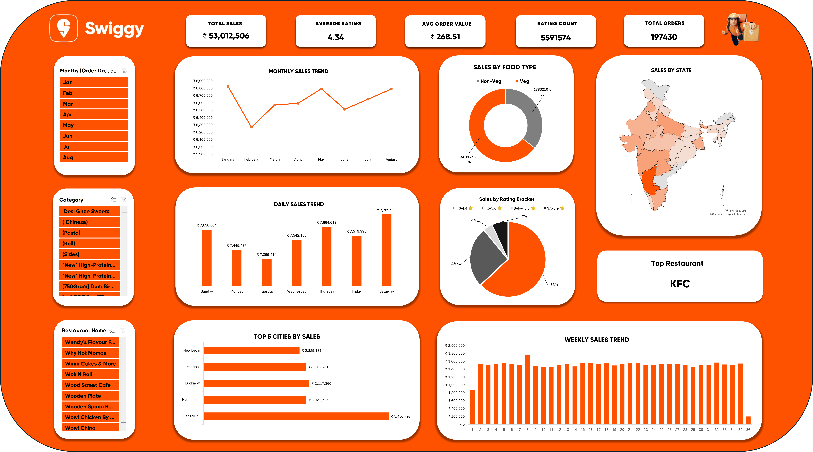
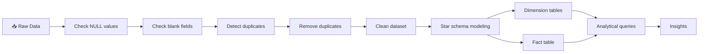

<div align="center">
<!-- ANIMATED HERO BANNER -->

<h3>
  
</h3>
<!-- TECHNOLOGY BADGES -->
<p>
  
  
  
  
</p>
<!-- STATUS BADGES -->
<p>
  
  
  
  
</p>

--- 

### 👤 **Created by Omkar Ashok Mandhare**
<a href="https://www.linkedin.com/in/omkarmandhare-data">
  
</a>
<a href="mailto:omkarmandhare666@gmail.com">
  
</a>
<a href="https://www.linkedin.com/in/omkarmandhare-data">
  
</a>

---
<!-- QUICK STATS -->
<table>
  <tr>
    <td align="center" width="25%">
      
      <br><b style="font-size: 24px;">📦 197,430</b>
      <br><sub>Dataset Records</sub>
    </td>
    <td align="center" width="25%">
      
      <br><b style="font-size: 24px;">💰 ₹53M</b>
      <br><sub>Total Revenue in Dataset</sub>
    </td>
    <td align="center" width="25%">
      
      <br><b style="font-size: 24px;">⭐ 4.34/5</b>
      <br><sub>Average Rating Analyzed</sub>
    </td>
    <td align="center" width="25%">
      
      <br><b style="font-size: 24px;">🗺️ 28 States</b>
      <br><sub>Geographic Coverage</sub>
    </td>
  </tr>
</table>
</div>

---

## 📑 Table of Contents

<details open>
<summary><b>📂 Click to expand/collapse navigation</b></summary>
<br>

| Section | Description |
|---------|-------------|
| [🎯 Executive Summary](#-executive-summary) | Project overview & impact |
| [✨ Project Highlights](#-project-highlights) | Key achievements |
| [🏗️ Architecture & Design](#️-architecture--design) | Star schema implementation |
| [🔍 Data Quality & Validation Pipeline](#--data-quality--validation-pipeline) | ETL & validation |
| [📊 Business Insights](#-business-insights) | Analytics & findings |
| [💡 Key Insights](#-key-insights) | Action plan |
| [💻 Technical Stack](#-technical-stack) | Technologies used |
| [📁 Repository Structure](#-repository-structure) | Project files |
| [🚀 Getting Started](#-getting-started) | Setup guide |
| [🎓 SQL Skills Applied](#-skills-demonstrated) | Competencies |
| [📞 Contact](#-contact) | Connect with me |

</details>


---

## 🎯 Executive Summary

> **A hands-on SQL analytics portfolio project focused on dimensional modeling and data-driven analysis**

<table>
<tr>
<td width="50%">

### 📊 **Project Overview**

This portfolio project showcases **Data analytics** and **SQL** skills through analysis of a public Swiggy food delivery dataset. Using dimensional modeling principles (Kimball methodology), I designed a star schema data warehouse to analyze **197,430 orders** spanning **8 months** across **28 Indian states**.

**Key Achievements:**
- ✅ Designed **Star Schema** architecture
- ✅ Performed **data cleaning** and **validation** on the dataset
- ✅ Derived **analytical insights** from a **₹53M** dataset
- ✅ Created **25+ analytical SQL queries**
- ✅ Built **interactive dashboards**

</td>
<td width="50%">


### 📈 **Business Metrics**

| Metric | Value |
|--------|-------|
| **Dataset Revenue** | ₹53,012,506 |
| **Average Order Value** | ₹268 |
| **Customer Rating** | 4.34/5 ⭐ |
| **Orders Analyzed** | 197,430 |
| **Time Period** | 8 Months |
| **Geographic Reach** | 28 States |
| **Data Quality** | Validated |


</td>
</tr>
</table>

---


## ✨ Project Highlights

<div align="center">

### 🌟 **What This Project Demonstrates**

</div>

<div align="center">

<table>
<tr>
<td width="33%" align="center" style="padding: 20px;">

<h3>🏗️ Architecture</h3>
<b>Star Schema Excellence</b>
<br><br>
<div align="left" style="padding: 0 30px;">
✅ 5 Dimension Tables<br>
✅ 1 Fact Table<br>
✅ Normalized Structure<br>
✅ Query Optimization
</div>
<br>

</td>
<td width="34%" align="center" style="padding: 20px;">

<h3>🧹 Data Quality</h3>
<b>Clean & Validated Dataset</b>
<br><br>
<div align="left" style="padding: 0 30px;">
✅ NULL Detection<br>
✅ Duplicate Removal<br>
✅ Blank Validation<br>
✅ Integrity Checks<br>
✅ 197K validated records
</div>
<br>

</td>
<td width="33%" align="center" style="padding: 20px;">

<h3>📊 Analytics</h3>
<b>SQL-Based Analytics</b>
<br><br>
<div align="left" style="padding: 0 30px;">
✅ 25+ SQL Queries<br>
✅ Multi-dimensional Analysis<br>
✅ Interactive Dashboards<br>
✅ Dataset-driven insights<br>
✅ Data Storytelling
</div>
<br>

</td>
</tr>
</table>

</div>

---


## 🏗️ Architecture & Design

<div align="center">

### 🎨 **Star Schema Implementation**


</div>

### 📐 **Database Architecture**
<br>

<div align="center">


**Star Schema Design** | 5 Dimension Tables + 1 Fact Table


</div>

### 📊 **Interactive Dashboard**
<br>

<div align="center">



**Excel-Based Analytics Dashboard** | Interactive Filters & KPIs


</div>

### 📊 **Table Specifications**

<table align="center">
<thead>
<tr>
<th width="15%">Type</th>
<th width="20%">Table Name</th>
<th width="35%">Business Purpose</th>
<th width="30%">Key Fields</th>
</tr>
</thead>
<tbody>
<tr>
<td></td>
<td><code>dim_date</code></td>
<td>Time-based analysis & trends</td>
<td>Year, Month, Quarter, Day, Week</td>
</tr>
<tr>
<td></td>
<td><code>dim_location</code></td>
<td>Geographic performance analysis</td>
<td>State, City, Location</td>
</tr>
<tr>
<td></td>
<td><code>dim_restaurant</code></td>
<td>Restaurant performance tracking</td>
<td>Restaurant_Name</td>
</tr>
<tr>
<td></td>
<td><code>dim_category</code></td>
<td>Cuisine & category insights</td>
<td>Category</td>
</tr>
<tr>
<td></td>
<td><code>dim_dish</code></td>
<td>Menu item analysis</td>
<td>Dish_Name</td>
</tr>
<tr>
<td></td>
<td><code><b>fact_swiggy_orders</b></code></td>
<td><b>Central transaction store</b></td>
<td><b>Price, Rating, All FKs</b></td>
</tr>
</tbody>
</table>

### ⚡ **Architecture Benefits**

<table align="center">
<tr>
<td width="25%" align="center">

<br><b>⚡Query Efficiency</b>
<br><sub>Optimized joins enable faster aggregations </sub>
</td>
<td width="25%" align="center">

<br><b>📈 Structure</b>
<br><sub> Fact–dimension separation improves readability</sub>
</td>
<td width="25%" align="center">

<br><b>🔧 Clarity</b>
<br><sub>Clean schema design is easy to extend</sub>
</td>
<td width="25%" align="center">

<br><b>📊 BI-Compatible </b>
<br><sub>Easily consumable by Excel dashboards</sub>
</td>
</tr>
</table>

---


## 🔍  Data Quality & Validation Pipeline

<div align="center">

### 🛡️ Validation Workflow

</div>

### 🔄 Validation Workflow




### 🧹 **4-Stage Quality Framework**

<table align="center">
<tr>
<td width="25%" align="center">

#### **1️⃣ NULL Detection**


**Scanned  critical columns**

```sql
✅ 0 NULL values
✅ 100% complete
```

</td>
<td width="25%" align="center">

#### **2️⃣ Blank Check**


**Validated string fields**

```sql
✅ No blanks
✅ All populated
```

</td>
<td width="25%" align="center">

#### **3️⃣ Duplicates**


**GROUP BY analysis**

```sql
✅ Detected
✅ Flagged
```

</td>
<td width="25%" align="center">

#### **4️⃣ Removal**


**ROW_NUMBER() CTE**

```sql
✅ Removed
✅ 197K records
```

</td>
</tr>
</table>


### ✅ **Data Quality Results**

<div align="center">

| Check | Result | Status |
|--------|-------|--------|
| **NULL Values** | 0 |  |
| **Blank Fields** | 0 |  |
| **Duplicates** | Removed |  |
| **Data Integrity** | Validated |  |
| **Overall Quality** | Clean Dataset |  |

</div>

---

## 📊 Business Insights

<div align="center">

### 💎 **Analysis of 197,430 Orders from Dataset**

</div>

### 💰 **Revenue Overview**

<table align="center">
<tr>
<td width="33%" align="center">

<h2>₹53,012,506</h2>
<b>Total Revenue</b>
<br><sub>Dataset period</sub>
<br><br>
</td>
<td width="33%" align="center">

<h2>₹268</h2>
<b>Avg Order Value</b>
<br><sub>Per transaction</sub>
<br><br>
</td>
<td width="33%" align="center">

<h2>₹6.8M</h2>
<b>Peak Month</b>
<br><sub>January 2025</sub>
<br><br>
</td>
</tr>
</table>


### ⭐ **Customer Satisfaction Matrix**
<br>
<div align="center">

<table>
<tr><th colspan="3">📊 CUSTOMER RATING DISTRIBUTION ANALYSIS</th></tr>
<tr>
  <td><b>4.5 – 5.0 ⭐</b></td>
  <td>███████████████</td>
  <td><b>High (26%)</b></td>
</tr>
<tr>
  <td><b>4.0 – 4.4 ⭐</b></td>
  <td>██████████████████████████</td>
  <td><b>Very High (63%)</b></td>
</tr>
<tr>
  <td><b>3.5 – 3.9 ⭐</b></td>
  <td>████</td>
  <td><b>Moderate (7%)</b></td>
</tr>
<tr>
  <td><b>< 3.5 ⭐</b></td>
  <td>██</td>
  <td><b>Low (4%)</b></td>
</tr>
<tr><td colspan="3"><b>📊 Average Rating: 4.34 / 5 ⭐</b><br><b>🔍 Insight: Majority of orders fall in the 4.0+ range</b></td></tr>
</table>
<br>


</div>


### 🌍 **Top Performing Locations**
<br>
<table align="center">
<tr>
<td width="20%" align="center">

<br><br>
<b>Bengaluru</b>
<br><br>
<code>₹5,454,977</code>
<br>
</td>
<td width="20%" align="center">

<br><br>
<b>Lucknow</b>
<br><br>
<code>₹3,117,360</code>
<br>
</td>
<td width="20%" align="center">

<br><br>
<b>Hyderabad</b>
<br><br>
<code>₹3,021,712</code>
<br>
</td>
<td width="20%" align="center">

<br><br>
<b>Mumbai</b>
<br><br>
<code>₹3,015,573</code>
<br>
</td>
<td width="20%" align="center">

<br><br>
<b>New Delhi</b>
<br><br>
<code>₹2,829,181</code>
<br>
</td>
</tr>
</table>
<br>


### 🍕 **Category & Restaurant Performance**
<br>
<table align="center">
<tr>
<td width="50%">

#### 🏆 **Top 5 Categories**

| Rank | Category | Revenue |
|------|----------|---------|
| 🥇 | **Recommended** | ₹7,187,609 | 
| 🥈 | Main Course | ₹767,175 | 
| 🥉 | Burgers | ₹695,149 |
| 4️⃣ | Burger Combos ( 3 Pc Meals )| ₹507,774 | 
| 5️⃣ | Sweets | ₹475,068 | 

</td>
<td width="50%">

#### 🏪 **Top 5 Restaurants**

| Rank | Restaurant | Revenue | 
|------|------------|---------|
| 🥇 | **KFC** | ₹4,243,972 | 
| 🥈 | McDonald's | ₹3,341,817 |
| 🥉 | Pizza Hut | ₹2,133,266 | 
| 4️⃣ | Burger King | ₹1,900,219 |
| 5️⃣ | Domino's Pizza | ₹1,831,948 | 

</td>
</tr>
</table>


<br>


### 💳 **Order Value Distribution**
<div align="center">

<table>
<tr><th colspan="3">💰 CUSTOMER SPENDING DISTRIBUTION</th></tr>
<tr>
  <td><b>₹200–299</b></td>
  <td>████████████████████████████████████</td>
  <td><b>54,164 (27.4%)</b></td>
</tr>
<tr>
  <td><b>₹100–199</b></td>
  <td>██████████████████████████████</td>
  <td><b>51,821 (26.3%)</b></td>
</tr>
<tr>
  <td><b>₹300–499</b></td>
  <td>████████████████████████</td>
  <td><b>48,162 (24.4%)</b></td>
</tr>
<tr>
  <td><b>< ₹100</b></td>
  <td>████████████</td>
  <td><b>26,789 (13.6%)</b></td>
</tr>
<tr>
  <td><b>₹500+</b></td>
  <td>████████</td>
  <td><b>16,440 (8.3%)</b></td>
</tr>
<tr><td colspan="3"><b>🎯 Optimal Price Point: ₹200–299 (27.4%)</b><br></td></tr>
</table>


</div>


---

## 💡 Key Insights

<div align="center">

### 🎯 **Analysis Findings from Dataset**


</div>

### 📋 **5 Key Observations**

<table align="center">

<tr>
<td width="20%" align="center">

<br><b>🗺️ Geographic Patterns</b>
<br><br>

</td>
<td width="80%">
<b>Finding:</b> Bengaluru leads with ₹5.45M (18.0% of top 10 dataset)<br>
<b>Pattern:</b> Top 5 metro cities account for 57.4% of total revenue<br>
<b>Observation:</b> Urban centers show concentrated demand, with Bengaluru far ahead and metros dominating share<br>
<br>
</td>
</tr>

<tr>
<td width="20%" align="center">
<br><b>⏰ Temporal Analysis</b>
<br><br>

</td>
<td width="80%">
<b>Finding:</b> Saturday generated ₹7.77M in the dataset period<br>
<b>Pattern:</b> Weekend orders showed 28.6% of total transaction volume <br>
<b>Observation:</b> Clear weekly ordering patterns with weekend spikes observed in the data<br>
<br>
</td>
</tr>

<tr>
<td width="20%" align="center">

<br><b>🎯 Category Performance</b>
<br><br>

</td>
<td width="80%">
<b>Finding:</b> "Recommended" category generated ₹7.19M (52.3% of dataset revenue)<br>
<b>Pattern:</b> Recommendations dominate, accounting for over half of total category revenue<br>
<b>Observation:</b> Platform recommendations strongly influence customer ordering behavior, far outweighing individual menu categories<br>
<br>
</td>
</tr>

<tr>
<td width="20%" align="center">

<br><b>💰 Pricing Insights</b>
<br><br>

</td>
<td width="80%">
<b>Finding:</b> ₹200-299 range contains 27.4% of all orders<br>
<b>Pattern:</b> Clear clustering around mid-range pricing tiers<br>
<b>Observation:</b> Price sensitivity is evident, with customers showing strong preference for affordable mid-range bands<br>
<br>

</td>
</tr>

<tr>
<td width="20%" align="center">
<br><b>⭐ Rating Distribution</b>
<br><br>

</td>
<td width="80%">
<b>Finding:</b> 4.34/5 average across 197K orders<br>
<b>Pattern:</b> 43% of orders received 4.4/5 rating<br>
<b>Observation:</b> Strong satisfaction levels reflected in rating distribution<br>
<br>

</td>
</tr>

</table>

---


## 💻 Technical Stack

<div align="center">

### 🛠️ **Technologies & Tools**

</div>

<table align="center">
<tr>
<td width="25%" align="center">

<br><b>MySQL 8.0</b>
<br><sub>Database Engine</sub>
<br><br>

<br>
</td>
<td width="25%" align="center">

<br><b>Excel</b>
<br><sub>Dashboards & Viz</sub>
<br><br>

<br>
</td>
<td width="25%" align="center">

<br><b>SQL</b>
<br><sub>Analysis Queries</sub>
<br><br>

<br>
</td>
<td width="25%" align="center">

<br><b>Git</b>
<br><sub>Version Control</sub>
<br><br>

<br>
</td>
</tr>
</table>


---

## 📁 Repository Structure
```
📦 Swiggy_Sales_Analysis/
│
├── 📄 README.md                          ← This file
├── 🚫 .gitignore                         
│
├── 📂 sql/
│   └── 📜 Swiggy_Queries_Complete.sql    ← 25+ analysis queries
│
├── 📂 docs/
│   ├── 📘 ARCHITECTURE.md                ← Design documentation
│   ├── 📗 DATA_DICTIONARY.md             ← Column specifications
│   └── 📙 FINDINGS_AND_INSIGHTS.md       ← Analysis summary
│
├── 📂 diagrams/
│   └── 🖼️ ER.jpg                         ← ER diagram
│
└── 📂 dashboards/
    └── 📊 Swiggy_Sales_Dashboard.xlsx    ← Excel dashboard
```

---


## 🚀 Getting Started

This project is designed for straightforward review and exploration.

1. **Explore the Excel Dashboard**
   - Open `dashboards/Swiggy_Sales_Dashboard.xlsx`.
   - The workbook contains the complete dataset along with pivot tables and an interactive dashboard.
   - You can explore KPIs, filters, and insights directly without any setup.

2. **Review SQL Analysis**
   - Navigate to `sql/Swiggy_Queries.sql` to review all SQL queries used for data transformation, analysis, and insight generation.

3. **Understand the Data Model**
   - Refer to `diagrams/ER_Diagram.png` to understand the star schema design and table relationships implemented in the project.

No additional setup or external data files are required.  
The full dataset used for analysis is already included within the Excel workbook for transparency and validation.


## 🏁 Conclusion
```
This project demonstrates end-to-end data analysis using SQL, dimensional modeling, and Excel-based dashboards.
It focuses on descriptive analytics to extract meaningful patterns and insights from a real-world food delivery dataset.
The project highlights practical skills in data modeling, query design, and business-focused analysis.
```


## 🎓 **SQL Skills Applied**

<table align="center">
<tr>
<td width="50%">

### 📊 Core Techniques
- ✅ JOINs (Multiple table operations)
- ✅ Aggregations (SUM, AVG, COUNT)
- ✅ GROUP BY (Data grouping)
- ✅ CASE Statements (Conditional logic)
- ✅ Date Functions (Temporal analysis)

</td>
<td width="50%">

### 🚀 Advanced Concepts
- ✅ CTEs (Common Table Expressions)
- ✅ Window Functions (Analytical queries)
- ✅ ROW_NUMBER() (Ranking)
- ✅ Subqueries (Nested queries)
- ✅ Query Design (Optimization)

</td>
</tr>
</table>


---

## 📞 Contact

<div align="center">

### 💬 **Let's Connect!**

<a href="https://www.linkedin.com/in/omkarmandhare-data">
  
</a>
<a href="mailto:omkar@example.com">
  
</a>
<a href="https://www.linkedin.com/in/omkarmandhare-data">
  
</a>

**Open to:** Data Analyst |  Business Intelligence roles

---

### 📊 Project Metrics


---

<sub>**Built with** ❤️ **by Omkar Mandhare** | **Powered by** SQL & Data Science</sub>


</div>
